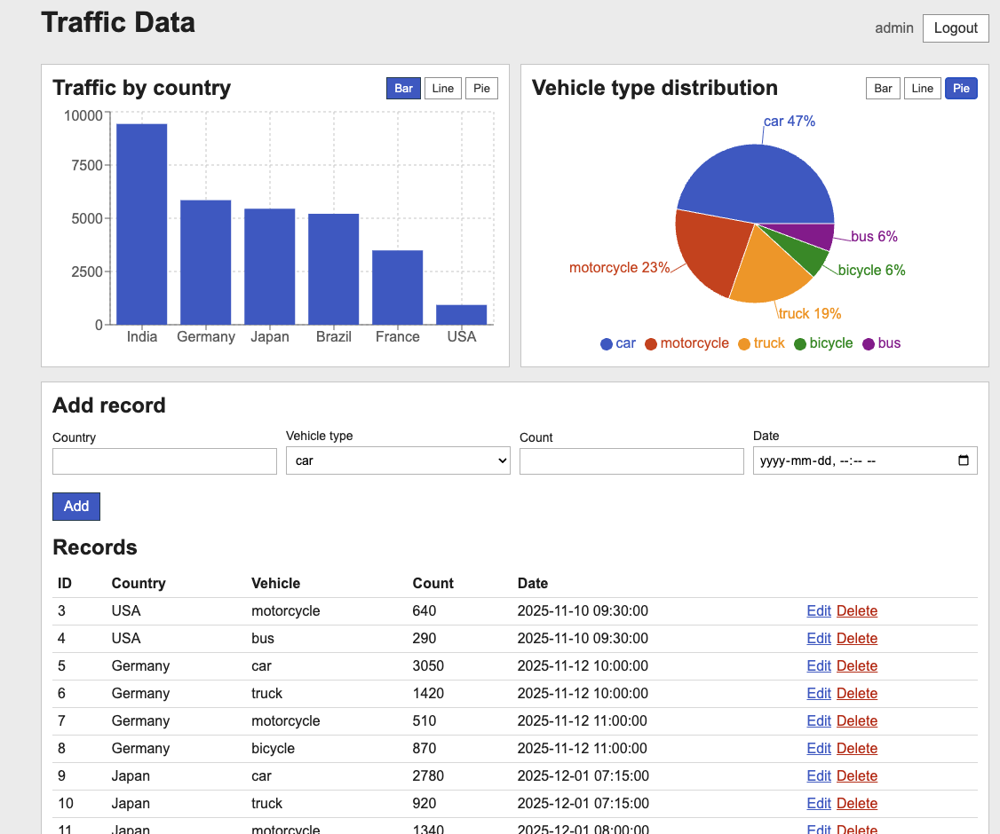
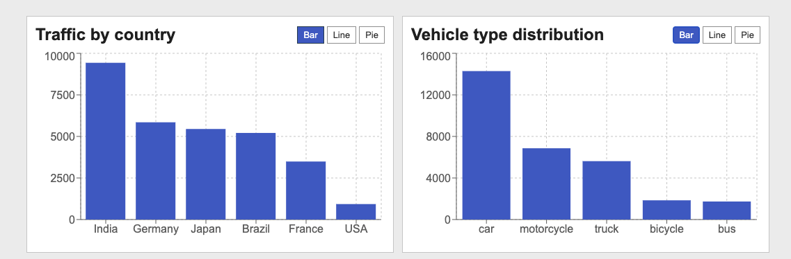
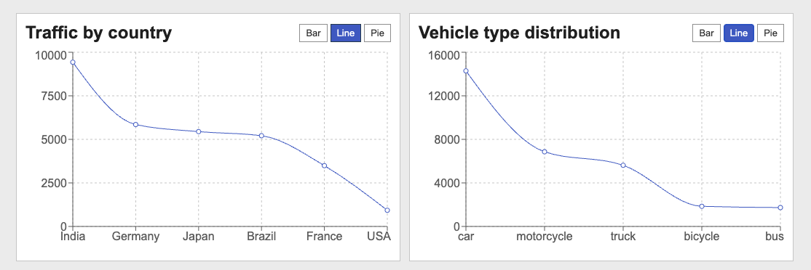
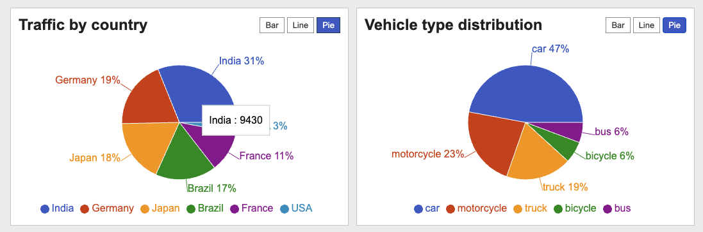
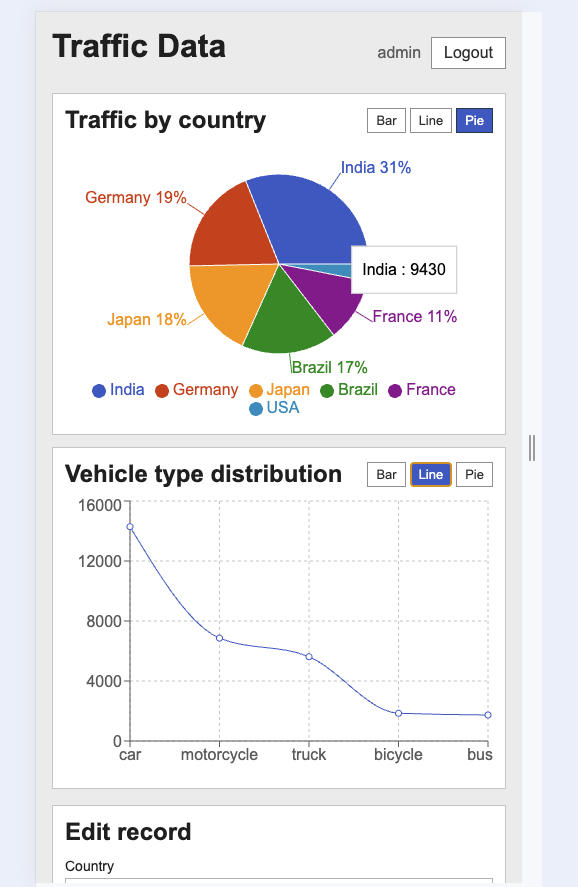
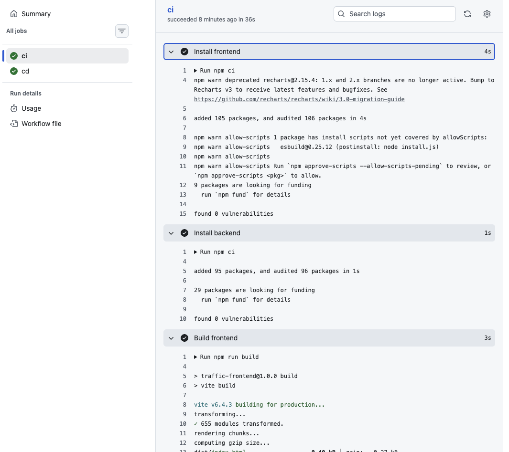

# Traffic Data

React + node.js (Express) + MySQL. Charts for country traffic and vehicle types.




## Chart




## obile


## How to run

```
docker compose up --build
```

Then open [http://127.0.0.1:3000/](http://127.0.0.1:3000/)

login: admin / admin123

## Folders

- `backend` - api
- `frontend` - react app
- `db/init.sql` - schema + some sample rows

## API

- POST /api/login - Sign IN
- GET /api/traffic - all
- GET /api/traffic/by-country - By country, for the country graff
- GET /api/traffic/by-vehicle  - By vehicle, for the vehicle graff
- POST /api/traffic - crate new insert 
- PUT /api/traffic/:id - update by ID
- DELETE /api/traffic/:id - Delete by ID

Protected routes need `Authorization: Bearer <token>` 
need be Sign IN if not you get 401 not authorised 

## Scaling notes

- 5 RPS - this setup is fine, one backend + mysql
- 50 RPS - indexes help (already on country/vehicle_type), use connection pooling, maybe cache the chart endpoints for a bit
- 500 RPS - run more backend instances behind a load balancer, mysql read replica for the chart queries, redis for cached aggregates, if need serch for data need add ElasticSerch for fast serching searching.  
  

## CI/CD

GitHub Actions workflow in `.github/workflows/ci-cd.yml`:

- on push/PR: install deps, build the frontend, build docker images


